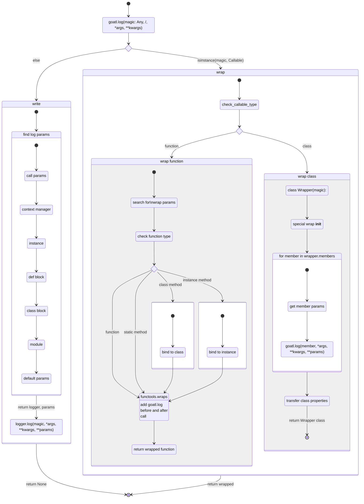

# GOATL mechanic

## log magic flow

```mermaid
stateDiagram-v2
    [*] --> log
    state  "goatl.log(magic: Any, /, *args, **kwargs)" as log
    state magic <<choice>>
    log --> magic
    magic --> wrap: isinstance(magic, Callable)
    magic --> write: else

    state wrap {
        [*] --> check_callable_type

        state check_callable_type
        state callable_type <<choice>>
        check_callable_type --> callable_type
        callable_type --> wrap_function: function
        callable_type --> wrap_class: class

        state "wrap function" as wrap_function {
            state "search for\nwrap params" as find_wrap_params
            state "check function type" as check_function_type
            state function_type <<choice>>
            [*] --> find_wrap_params
            find_wrap_params --> check_function_type
            check_function_type --> function_type
            function_type --> f_wrap : function
            function_type --> f_wrap : static method
            function_type --> f3 : class method
            function_type --> f4 : instance method

            state " " as f3 {
                [*] -->  bind_f3
                state "bind to class" as bind_f3
                bind_f3 --> f_wrap
            }

            state " " as f4 {
                [*] -->  bind_f4
                state "bind to instance" as bind_f4
                bind_f4 --> f_wrap
            }

            state "functools.wraps" as f_wrap
            state "add goatl.log\nbefore and after\ncall" as f_wrap
            f_wrap --> return_f


            state "return wrapped function" as return_f
        }


        state "wrap class" as wrap_class {
            state "class Wrapper(magic):" as wrapper
            state "special wrap __init__" as init_wrap
            wrapper --> init_wrap
            init_wrap --> class_for
            state "for member in wrapper.members" as class_for {
                [*] --> get_member_params
                state "get member params" as get_member_params
                get_member_params --> wrap_member
                state "goatl.log(member, *args, **kwargs, **params)" as wrap_member
            }
            state "transfer class properties" as trans_cls
            class_for --> trans_cls
            trans_cls --> [*] : return Wrapper class

        }

    }

    state "find log params" as check_write_params {
        [*] --> call_params
        state "call params" as call_params
        state "context manager" as context_manager
        state "instance" as instance
        state "def block" as def_block
        state "class block" as class_block
        state "module" as module
        state "default params" as default_params
        call_params --> context_manager
        context_manager --> instance
        instance --> def_block
        def_block --> class_block
        class_block --> module
        module --> default_params
    }

    state write {
        [*] --> check_write_params
        check_write_params --> write_to_log : return logger, params

        state "logger.log(magic, *args, **kwargs, **params)" as write_to_log
    }

    write --> [*] : return None
    wrap --> [*] : return wrapped
```
